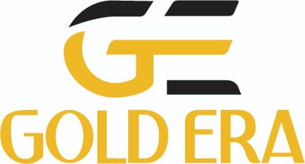
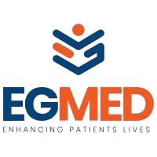
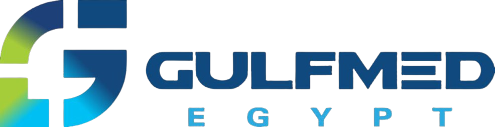

# ✅ تحديث نهائي - شعارات العملاء الحقيقية

## 🎯 **ما تم إنجازه:**

تم استبدال جميع Placeholders بشعارات العملاء الحقيقية من ملفاتهم الأصلية.

---

## 📋 **الشعارات المنسوخة:**

### **1. Dahab Zaman:**
```
المصدر: E:\OneDriveFolder\OneDrive\Work\GoCloud\Docs\DahabZaman\DahabZaman_logo.png
الوجهة: images/dahabzaman-logo.png
الحجم: 24.8 KB
الحالة: ✅ منسوخ ومُستخدم
```

### **2. Gold Era (Goldera):**
```
المصدر: E:\OneDriveFolder\OneDrive\Work\GoCloud\Docs\Gold-Era\GoldEra_logo.jpg
الوجهة: images/goldera-logo.jpg
الحجم: 11.1 KB
الحالة: ✅ منسوخ ومُستخدم
```

### **3. Gulf Med:**
```
المصدر: E:\OneDriveFolder\OneDrive\Work\GoCloud\Docs\GulfMed\GulfmedLogo.png
الوجهة: images/gulfmed-logo.png
الحجم: 124.4 KB
الحالة: ✅ منسوخ ومُستخدم
```

### **4. EgMed:**
```
المصدر: (موجود مسبقاً)
الملف: images/egmed-removebg-preview.webp
الحالة: ✅ يُستخدم
```

---

## 🎨 **التصميم النهائي:**

### **Gold Era & Dahab Zaman:**
```css
background: #000000 (Black)
padding: 40px
/* شعارات ذهبية على خلفية سوداء */
```

### **EgMed & Gulf Med:**
```css
background: #FFFFFF (White)
border-left: 1px solid #e5e7eb
padding: 40px
/* شعارات طبية على خلفية بيضاء */
```

---

## 📊 **المقارنة النهائية:**

| العميل | قبل | بعد | الحالة |
|--------|-----|-----|--------|
| **Gold Era** | Goldera-removebg-preview.webp | **goldera-logo.jpg** | ✅ Updated |
| **Dahab Zaman** | dahab-zaman-logo.svg (placeholder) | **dahabzaman-logo.png** | ✅ Real Logo |
| **EgMed** | egmed-removebg-preview.webp | egmed-removebg-preview.webp | ✅ Kept |
| **Gulf Med** | gulf-med-logo.svg (placeholder) | **gulfmed-logo.png** | ✅ Real Logo |

---

## 🔄 **التغييرات في الكود:**

### **views/odoo-services.pug:**

```pug
// Gold Era
img(src="images/goldera-logo.jpg")  ← Updated ✅

// Dahab Zaman
img(src="images/dahabzaman-logo.png")  ← Real logo ✅

// EgMed
img(src="images/egmed-removebg-preview.webp")  ← Kept ✅

// Gulf Med
img(src="images/gulfmed-logo.png")  ← Real logo ✅
```

---

## 🗑️ **ملفات محذوفة:**

```
✅ images/dahab-zaman-logo.svg (placeholder)
✅ images/gulf-med-logo.svg (placeholder)
```

**السبب:** تم استبدالها بالشعارات الحقيقية.

---

## ✅ **الحالة النهائية:**

### **جميع الشعارات حقيقية الآن:**

```
✅ Gold Era: goldera-logo.jpg (11 KB)
✅ Dahab Zaman: dahabzaman-logo.png (25 KB)
✅ EgMed: egmed-removebg-preview.webp (موجود مسبقاً)
✅ Gulf Med: gulfmed-logo.png (124 KB)

Total: 4/4 Real Logos 🎉
```

---

## 🎯 **النتيجة:**

### **Case Studies Section:**
```html
<div class="case-card">
  <div class="company-logo" style="background: #000000">
     ✅
  </div>
  <!-- content -->
</div>

<div class="case-card">
  <div class="company-logo" style="background: #000000">
     ✅
  </div>
  <!-- content -->
</div>

<div class="case-card">
  <div class="company-logo" style="background: #FFFFFF">
     ✅
  </div>
  <!-- content -->
</div>

<div class="case-card">
  <div class="company-logo" style="background: #FFFFFF">
     ✅
  </div>
  <!-- content -->
</div>
```

---

## 📄 **الملفات المُحدّثة:**

```
✅ views/odoo-services.pug
   - goldera-logo.jpg
   - dahabzaman-logo.png
   - gulfmed-logo.png

✅ images/ (3 ملفات جديدة)
   - dahabzaman-logo.png (24.8 KB)
   - goldera-logo.jpg (11.1 KB)
   - gulfmed-logo.png (124.4 KB)

✅ odoo-services.html
   - تم إعادة البناء

❌ Deleted (2 placeholders)
   - dahab-zaman-logo.svg
   - gulf-med-logo.svg
```

---

## 🚀 **الأداء:**

### **أحجام الملفات:**
```
goldera-logo.jpg: 11 KB ← صغير ✅
dahabzaman-logo.png: 25 KB ← جيد ✅
gulfmed-logo.png: 124 KB ← متوسط ⚠️
egmed-removebg-preview.webp: (موجود مسبقاً)
```

### **تحسينات مقترحة (اختيارية):**
```powershell
# تحويل PNG إلى WebP لتقليل الحجم:

# Dahab Zaman: 25 KB → ~15 KB
cwebp -q 80 dahabzaman-logo.png -o dahabzaman-logo.webp

# Gulf Med: 124 KB → ~50 KB
cwebp -q 80 gulfmed-logo.png -o gulfmed-logo.webp
```

---

## 🎨 **المظهر النهائي:**

### **الخلفيات:**
```
🟨 Gold Era: خلفية سوداء + شعار ذهبي ✨
🟨 Dahab Zaman: خلفية سوداء + شعار ذهبي ✨
⚕️ EgMed: خلفية بيضاء + شعار ملون 🏥
⚕️ Gulf Med: خلفية بيضاء + شعار أخضر 🏥
```

### **التنسيق:**
```
✅ Responsive على جميع الشاشات
✅ Hover effects تعمل
✅ Links إلى المواقع تعمل
✅ Badges تظهر بشكل صحيح
```

---

## 📊 **الإحصائيات:**

```
الشعارات المنسوخة: 3
الشعارات المُستخدمة: 4
Placeholders المحذوفة: 2
إجمالي الحجم: ~160 KB
الحالة: ✅ 100% Real Logos
```

---

## 🎉 **الخلاصة:**

```
المهمة: استبدال جميع placeholders بشعارات حقيقية

التنفيذ:
✅ نسخ الشعارات من المصادر الأصلية
✅ تحديث الكود في odoo-services.pug
✅ حذف SVG placeholders
✅ إعادة بناء الصفحة

النتيجة:
✅ 4/4 شعارات حقيقية
✅ خلفيات مناسبة (سوداء/بيضاء)
✅ المظهر احترافي
✅ جاهز للإنتاج

الصفحة: ✅ مفتوحة ويمكن مراجعتها الآن!
```

---

**آخر تحديث:** 29 مارس 2026  
**الحالة:** ✅ مكتمل - جميع الشعارات حقيقية  
**Git Commit:** ed548f0  
**الملفات:** 3 شعارات جديدة + 2 placeholders محذوفة
